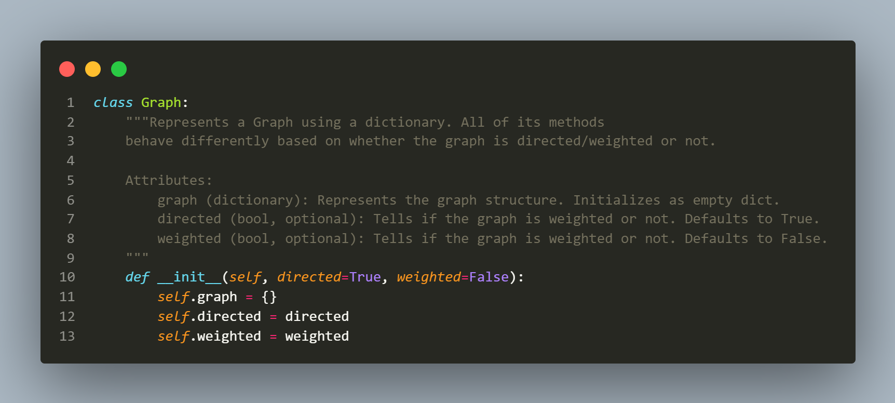

# Documentação

# Sumário
1. [Introdução a Grafos](#1)
    -   [Grafo Direcionado](#1.1)
    -   [Grafo Ponderado](#1.2)
    -   [Tamanho](#1.3)
    -   [Ordem](#1.4)
    -   [Adjacência](#1.5)
    -   [Grau](#1.6)
    -   [Algoritmo de Dijkstra](#1.7)
2. [Backend & Frontend](#2)
    - [Backend](#2.1)
    - [Frontend](#2.2)
4. [Banco de Horas](#3)

# Introdução a Grafos
***
Grafo é um par de conjuntos: `vértices`, `arestas`, onde cada `aresta` é um par ordenado de `vértices`.
***

## Grafo Direcionado
Um grafo é direcionado quando suas `arestas` podem ser chamadas de `vetores` ou `setas`, pois possuem direção, um `vértice` de origem e um `vértice` de entrada.

## Grafo Ponderado
Um grafo é ponderado quando suas arestas possuem pesos.

## Tamanho
Número de arestas do Grafo.

## Ordem
Número de vértices do Grafo

## Adjacência

>### Adjacência(Não Direcionado)
> É a relação entre vértices que compartilham uma mesma `aresta`. 

>### Adjacência(Direcionado)
> Dado um vértice `v`, A relação de Adjacência em Grafos Direcionados mostra a lista de vértices adjacentes de entrada e a lista de vértices adjacentes de saída.

## Grau
>### Grau do Vértice(Não Direcionado)
> O grau de um vértice é o número de arestas incidentes para com o vértice

>### Grau do Vértice(Direcionado)
>A seqüência de graus de um gráfico direcionado é a lista de seus pares `indegree` e `outdegree`.
> - Indegree é o número de arestas que estão entrando no vértice.
> - Outdegree é o número de arestas que estão saindo do vértice.

## Algoritmo de Dijkstra
Criado pelo holandês Edsger Dijkstra em 1956. Esse algoritmo soluciona o problema do caminho mais curto num grafo direcionado ou não direcionado com arestas de peso não negativo.

O algoritmo considera um conjunto `S` de menores caminhos, iniciado com um vértice inicial `V`. A cada passo do algoritmo busca-se nas adjacências dos vértices pertencentes a `S` aquele vértice com menor distância relativa a `V` e adiciona-o a `S` e, então, repetindo os passos até que todos os vértices alcançáveis por `V` estejam em `S`. Arestas que ligam vértices já pertencentes a `S` são desconsideradas

  

# Backend & Frontend

## Backend
- Fizemos toda a lógica em Python, seguindo o padrão estilístico do PEP8.
- Criamos uma classe `Graph` com os seguintes **atributos**:  
&emsp;   
    - `directed` - Booleano que recebe `True` se o Grafo for Direcionado, e `False` se o Grafo for Não-Direcionado
    - `weighted` - Booleano que recebe `True` se o Grafo for Ponderado, e `False` se o Grafo for Não-Ponderado
    - `graph` - Dicionário python onde será alocado os vertices e as arestas.  
- E os seguintes **métodos**:  
    - `add_edge` - Adiciona uma aresta com base nos vértices de origem e destino.
         
    - `print_graph` - Printa um Grafo de uma Maneira Simplificada.
         
    - `get_order` - Calcula a ordem do Grafo.
         
    - `get_size` -  Calcula o tamanho do Grafo.
         
    - `adjacency` - Verifica se dois vértices são adjacentes ou não.
         
    - `get_degree` - Calcula o grau de um dado vértice.
         
    - `get_adjacents` - Retorna os vértices adjacentes de um determinado vértice.
         
    

## Frontend
Feito em Node e React.js, seguindo padrão estilístico similar ao do AirBnB. A visualização de grafos é possível com uso da biblioteca react-graph-vis. Os detalhes visuais são feitos com ajuda da maravilhosa biblioteca Tailwind. É possível realizar as seguintes ações:
- Configurar seu novo grafo selecionando os checkboxes e apertando oo +. (Recomenda-se que faça primeiro, mas se feito com um grafo já existente, ele irá ser apagado.
- Adicionar arestas ao seu novo gráfico, escrevendo qual o Source e qual o Destiny e aperta no lápis. O peso é apenas possível de ser colocado se você tem um gráfico ponderado/valorado.
- Checar adjacência. Processo similar ao de cima.
- Ver ordem e tamanho do Grafo em tempo real (é mostrado em cima do programa)
- Clicar em um determinado Node (vértice) para ver detalhes dele como: 
    - O Gráu do Vértice (ingoing e outgoing caso seja direcionado)
    - Os vértices adjacentes a ele (ingoing e outgoing caso seja direcionado)

## Banco de Horas

|Atividade| Horas Usadas|
|:--|--:|
|Planejamento geral do projeto| 01:00|
|Planejamento da representação do grafo| 00:30|
|Criação da Classe e dos métodos iniciais| 01:00|
|Criação do método que verifica edges existentes| 00:10|
|Implementação do tratamento de grafos direcionados| 00:16|
|Implementação do tratamento de grafos ponderados| 00:15|
|Criação do método que retonra o tamanho do Grafo| 00:45|
|Criação do método que retonra a ordem do Grafo| 00:25|
|Criação do método que verifica adjacencia de 2 vértices| 00:27|
|Criação do método que verifica o grau de um dado vértice| 00:27|
|Criação do método que retonra a lista de vertices adjacentes| 00:15|
|Criação do método que implementa o algoritmo de Dijkstra| 01:18|
|Backend utilizando Flask| 03:30|
|Frontend utilizando ReactJS| 09:30|
|Documentação| 02:00|

#### Total: 21 horas e 30 minutos
